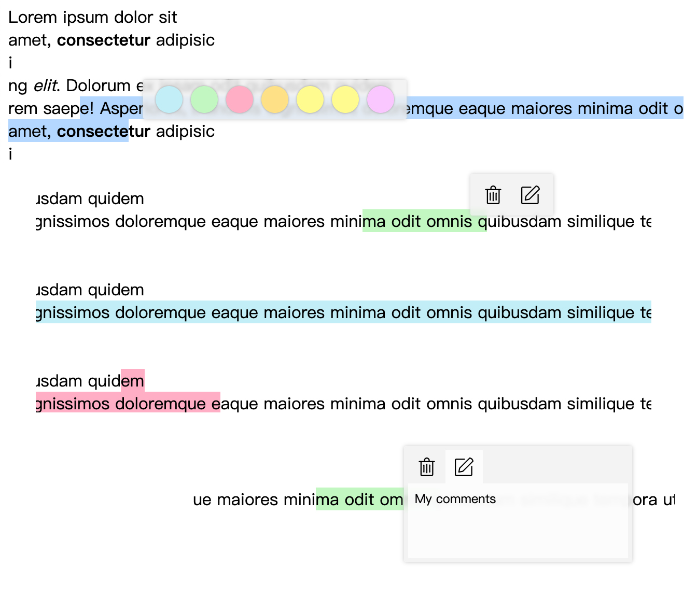
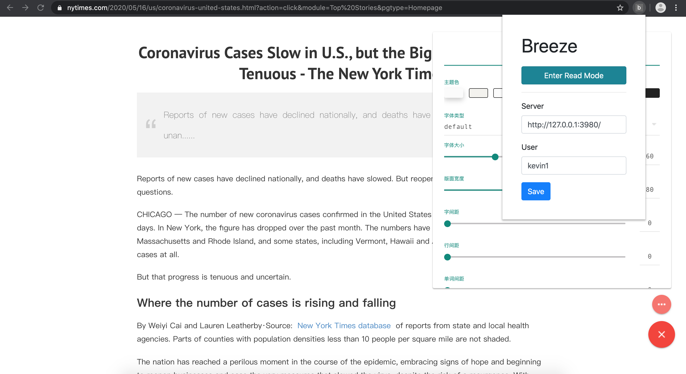

breeze
------

This project has been moved to https://github.com/notelix/notelix

Development of this project has stopped.

------

breeze is a multifunctional browser extension, meant to make reading, researching & note-taking from the web much easier.

It features:
* a web highlighter
* adding comments to highlights
* distraction-free reader mode (powered by simpread)

Road map:
* read later feature
* support for annotating pdf (pdf.js)
* dashboard for searching notes
* carets to show the position of annotations
* support html in comments
* BeeLine Reader, Sprint Reader
* use some simpread extensions
* more docs

It is **completely open-source** (backend + frontend), and can be deployed on-premise, or offered as a hosted service.

# demo

This project is still in very early stages of development

# special thanks
* alienzhou/web-highlighter
* Kenshin/simpread

# license
GPLv3
